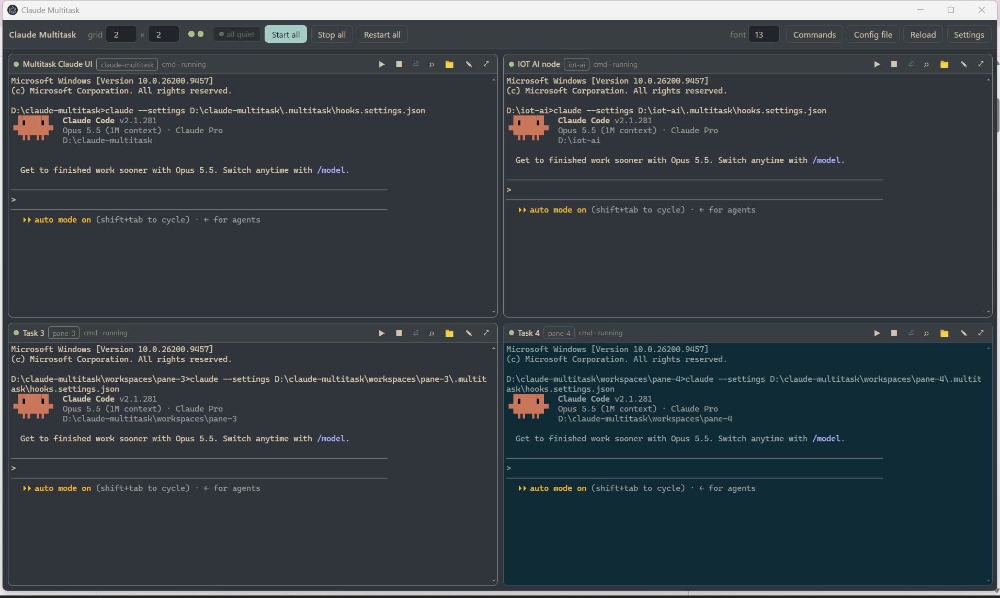
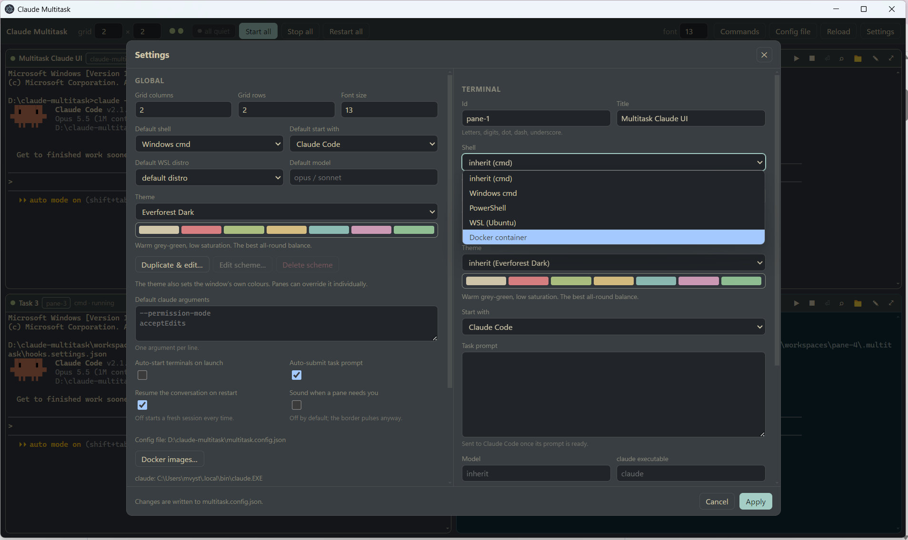

# Claude Multitask

A Windows 11 desktop app that runs a configurable grid of real terminals, each one running
its own Claude Code session on its own task, in its own folder.

> An unofficial community project. It is not affiliated with, endorsed by, or supported by
> Anthropic. "Claude" and "Claude Code" are trademarks of Anthropic, PBC. You need your own
> Claude Code installation and account.

Every pane is a genuine PTY (ConPTY), so Claude's TUI works exactly as it does in Windows
Terminal: you can watch a pane, click into it, and keep chatting in it yourself.

```
┌─ Alpha ── cmd · running ────────┬─ Beta ── wsl:Ubuntu-24.04 · running ─┐
│ ❯ refactor the auth module      │ ❯ build the project                  │
│ ● Write(auth.ts)                │ ● Bash(make)                         │
└─────────────────────────────────┴──────────────────────────────────────┘
workspaces/alpha/    workspaces/beta/     ← each pane's artifacts land here
```

### Layout - each pane has own shell and workspace


### Settings - including themes


## Requirements

- Windows 11 (x64)
- Node.js 20+ and npm, to build
- Claude Code on `PATH` (`claude`). For WSL panes, Claude Code must be installed
  *inside* the distro as well.
- Optional: WSL2 with at least one distro, for `wsl` panes
- Optional: Docker Desktop for Windows, for `docker` panes. Claude Code does **not** need
  to be installed on the host for those — the container image provides it.

## Getting started

```powershell
npm install
npm start          # build and run
```

On first launch the app writes `multitask.config.json` next to itself with four empty
panes. `multitask.config.example.json` shows a fuller setup you can copy over it.

To produce an installer and a portable exe in `release/`:

```powershell
npm run dist
```

`npm run dist` needs permission to create symbolic links, because electron-builder's
code-signing toolchain archive contains macOS symlinks. Without it the build stops after
writing `release/win-unpacked/` with:

> ERROR: Cannot create symbolic link : A required privilege is not held by the client.

Fix it by turning on **Settings → System → For developers → Developer Mode**, or by
running the command from an elevated terminal. `npx electron-builder --dir` produces the
runnable unpacked app in `release/win-unpacked/` without needing either.

## What a pane starts

Each pane picks one of three things to run, via **Start with** in Settings:

| Start with | What happens |
| --- | --- |
| **Claude Code** (default) | `claude <flags>` is typed in, the launcher waits for its TUI, then sends the task. |
| **A command of my own** | Your `command` is typed in verbatim — `ls -la`, `pwd`, `npm test`, `python`, anything. When the output settles, `task` is sent if you set one. |
| **Nothing — just open the shell** | Nothing is typed. The pane is a plain terminal. |

In the JSON this is `launch: "claude" | "command" | "shell"`. Setting `command` and leaving
`launch` out implies `"command"`, so this is enough:

```json
{ "id": "watch", "title": "Test watcher", "command": "npm test -- --watch" }
```

`model`, `claudeArgs` and `claudeBin` only apply to `launch: "claude"`; the pane editor
hides them otherwise.

Text in `task` is delivered differently depending on the mode. Claude's TUI gets a
bracketed paste, which keeps a multi-line task as one message and lets the launcher confirm
the text landed before pressing Enter. Anything else gets plain lines, one Enter each — so
a two-line task is two REPL evaluations, which is what typing it would do.

## How a pane starts

1. A PTY is spawned in the pane's folder using its shell profile.
2. Once the shell prints a prompt, the pane's command is typed into it.
3. The launcher waits for Claude's own TUI to appear — not merely for output to go quiet,
   because Claude is silent while Node boots and a prompt typed in that gap is swallowed.
4. The task is pasted in as a bracketed paste (so multi-line tasks stay one message), the
   launcher confirms the text actually landed in the prompt box, and only then presses
   Enter. A swallowed paste is retried once.

For Claude, readiness means one of its own footer hints ("for shortcuts", "shift+tab to
cycle"), not its startup banner — the banner is printed by the first-run wizard too, and
matching it would paste the task into a menu. An arbitrary command has no such marker, so
there the launcher waits for output to settle instead.

Three failures are reported on the pane instead of the task being typed somewhere harmful:

- the shell rejected the command (`claude: command not found`);
- Claude is showing first-run setup — a login prompt or a folder-trust dialog;
- Claude never signalled readiness at all, in which case the pane stays usable and the
  **⏎** button in its header sends the task by hand.

## Knowing which pane wants you

Watching four terminals is the thing that makes parallel agents tiring. The app doesn't ask
you to: each pane reports what its Claude session is actually doing, and the toolbar keeps
a count.

| Pane state | Means |
| --- | --- |
| **ready** | Claude has started and is idle. |
| **working** | Claude is thinking or running a tool — the header names the tool. |
| **needs you** | Claude finished its turn, or is asking for permission. |
| **session ended** | The conversation is over. |

Panes that are working fade back so the one that wants you stands out. **F8** jumps to the
next pane waiting on you, and so does clicking the counter. An OS notification appears only
when the window isn't focused — inside the app the border and counter already say it. Sound
is off unless you turn it on in Settings.

This is driven by Claude Code's own hook events, not by scraping the terminal. Each pane
gets a generated `.multitask/hooks.settings.json` passed via `claude --settings`, whose
hooks append one JSON line per event to `.multitask/events.ndjson`; the app tails that
file. So the state stays correct across Claude Code releases, and it works identically in
cmd, WSL and a container. A pane that sets its own `--settings` in `claudeArgs` keeps
yours, and simply reports no activity.

## Keeping the conversation across a restart

Restarting a pane used to throw away its context. Each pane now remembers its Claude
`session_id` (the hooks report it) and restarts with `--resume`, so the conversation
continues. **Start a fresh session** in the command palette clears it when you want a clean
slate, and `resume: false` turns it off per pane or globally.

## Command palette

**Ctrl+K** opens a fuzzy launcher for everything: go to a pane, restart it, start a fresh
session in it, send its task, open its folder, switch theme, start or stop everything, jump
to the next pane needing you. Typing `sda` finds "Start all". It is the fastest way to
drive the app, and it means Settings is for configuring things rather than doing them.

## Panes and folders

A pane and the folder it works in are independent. A pane is a slot in the grid with a
shell, a theme and a task; the folder is just where it currently works, and you can point
it somewhere else whenever the work moves on.

Use **Browse…** in the pane editor, or **Move … to another folder…** in the command
palette (`Ctrl+K`). Any folder on disk works — an existing project, a git checkout,
anywhere. The pane header shows the folder's name, and clicking it opens the folder.

Reassigning a running pane stops its terminal and says so; start it again when you are
ready. It also drops the remembered Claude conversation, because that conversation belongs
to the project the pane just left — the new folder starts fresh.

Leaving the folder blank keeps the old default of `workspaces/<pane id>`, so existing
configs behave exactly as before. One wrinkle that default creates: because the path is
derived from the id, renaming a pane that never chose a folder would silently point it at
an empty directory. The editor pins the old folder into the config first, so artifacts stay
with the pane.

Nothing stops two panes sharing a folder, since that is occasionally what you want, but
the editor warns — two Claude sessions editing one tree will overwrite each other.

## Layout on disk

Folders are stored relative when they sit under the app root and absolute when they do
not, so a config full of nearby projects stays readable.

```
<app root>/
  multitask.config.json          the one source of truth, hand-editable
  workspaces/
    alpha/                       pane cwd — everything Claude writes goes here
      .multitask/session.log     raw transcript of the pane, kept across restarts
      .multitask/events.ndjson   hook events, tailed for the pane's activity state
      .multitask/hooks.settings.json  generated; passed to claude via --settings
```

The app root is the repo in development, and the folder next to the `.exe` when packaged,
so the config and artifacts are always reachable without digging into `resources/`.

## Configuration

The Settings dialog (`Ctrl+,`) and the JSON file are the same thing — edit either. An
external edit is picked up automatically; **Reload** re-reads it on demand.

| Field | Meaning |
| --- | --- |
| `grid.cols` / `grid.rows` | Visible cells. More panes than cells simply scrolls. |
| `defaults` | Inherited by every pane that does not set the field itself. |
| `panes[].id` | Identity and default folder name. Letters, digits, `.`, `-`, `_`. |
| `panes[].profile` | `cmd`, `powershell`, `wsl`, or `docker` (see below). |
| `panes[].docker` | Container settings for a `docker` pane; see Docker panes. |
| `panes[].distro` | WSL distro name, for `wsl` panes. |
| `panes[].workspace` | Folder this pane works in, relative to the app root or absolute. Blank means `workspaces/<id>`. |
| `panes[].theme` | Terminal theme for this pane; overrides `defaults.theme`. |
| `panes[].launch` | `claude`, `command`, or `shell`. Inferred as `command` when `command` is set. |
| `panes[].command` | The command line for `launch: "command"`, typed verbatim. |
| `panes[].task` | Text sent once the program is ready — a prompt for Claude, stdin for anything else. |
| `panes[].model` | Passed as `--model`. |
| `panes[].claudeArgs` | Extra `claude` flags, e.g. `["--permission-mode","acceptEdits"]`. |
| `panes[].claudeBin` | Path to `claude` when it is not on that shell's `PATH`. |
| `panes[].env` | Extra environment variables for the pane. |
| `panes[].autoStart` | Start this pane when the app launches. |
| `panes[].autoSubmit` | Send the task automatically, or wait for the **⏎** button. |
| `panes[].resume` | Keep the conversation when this pane restarts. Default true. |
| `defaults.sound` | Play a short chime when a pane starts waiting on you. Default false. |

Panes are launched with the `CLAUDECODE`, `CLAUDE_CODE_CHILD_SESSION` and
`CLAUDE_CODE_ENTRYPOINT` variables removed, so each one is a fresh top-level session even
when the app itself was started from inside Claude Code.

## Themes

Nine terminal themes, picked and tuned for long sessions. Set one in Settings; it colours
the terminals **and** the app's own chrome, so the window reads as one surface. A pane can
override the theme, which doubles as a way to tell four terminals apart at a glance.

Contrast between body text and background is what decides eye comfort, and it cuts both
ways: too little and you squint, too much and you get glare. White on black is 21:1.
Everything here sits between 5:1 and 11:1 except the original Midnight, kept as an option
at 14:1.

| Theme | Body contrast | Character |
| --- | --- | --- |
| **Everforest Dark** (default) | 7.4:1 | Warm grey-green, low saturation. Best all-round balance. |
| **Selenized Dark** | 6.1:1 | Deep teal. Solarized's comfort with its legibility fixed. |
| **Solarized Dark** | 5.6:1 | The original low-strain palette. Softest dark. |
| **Nord** | 9.2:1 | Cool arctic blue-grey, very uniform. |
| **Gruvbox Dark** | 10.7:1 | Warm retro browns. Crisper, still warm. |
| **Catppuccin Mocha** | 11.3:1 | Muted pastel on deep violet. Best colour separation. |
| **Catppuccin Latte** | 7.1:1 | Light, for daylight. |
| **Solarized Light** | 5.0:1 | Cream paper. Softest light option. |
| **Midnight** | 14.1:1 | The app's original. Crisp, but can glare. |

Because Claude Code colours its output, a theme also has to stay *legible*, and two
upstream palettes did not. Gruvbox's normal red measured 2.7:1 against its own background
and Catppuccin Latte's yellow 2.3:1 — unreadable for diff lines — so both are adjusted
here. Zenburn was dropped: its red and green are too close to tell a diff apart, which is
inherent to the palette. Bright slots are real lighter colours rather than Solarized's
official grey remapping, which makes TUIs render wrong.

The app chrome is *derived* from each palette rather than hand-authored, so a new theme
needs no extra colour work and can never drift out of step. The derivation is
contrast-aware: dim text and the filled button adapt until they clear their targets.

### Saving your own

**Duplicate & edit…** in Settings opens the scheme editor: all twenty colours, a miniature
terminal preview, and a live contrast verdict that runs the same checks as the command
below, so an unreadable scheme says so before you save it. Starting from an existing theme
rather than a blank palette is deliberate — twenty colours from scratch is a chore.

Saved schemes live in `customThemes` in `multitask.config.json`, so they are listed
alongside the built-ins and come back on the next launch. **Edit scheme…** and **Delete
scheme** apply to your own; the built-in nine cannot be changed, only duplicated.

```powershell
npm run check:themes
```

re-measures every theme — body contrast, each ANSI colour, red/green separation, and the
derived UI colours — and exits non-zero if any regress. Terminals also run with xterm's
`minimumContrastRatio: 3`, a floor that catches what no palette can fix, such as the black
colour slot printed on a dark background.

## Shells

| Profile | How it runs |
| --- | --- |
| `cmd` | `cmd.exe` in the pane folder. |
| `powershell` | `pwsh.exe` if installed, otherwise `powershell.exe`. |
| `wsl` | `wsl.exe -d <distro> --cd <translated path>`; `D:\x` becomes `/mnt/d/x`. |
| `docker` | A container with the pane folder bind-mounted. See below. |

All four are entries in the `ShellProfile` registry in `src/main/profiles.ts`; adding a
fifth means adding one object there and nothing else.

## Docker panes

A docker pane runs its Claude Code session inside a container, with the pane's folder
bind-mounted so the artifacts still land in `workspaces/<id>/` on the host. This is the
profile to reach for when a task should install packages, run untrusted code, or needs a
Linux toolchain you do not want on your machine.

Two modes:

- **`run`** (default) starts a fresh container per pane, named `mt-<pane id>`, with
  `--rm` so it disappears on exit.
- **`exec`** attaches to a container you already have running — useful for a dev container
  that is already set up. Set `containerName` and a `workdir` that exists inside it.
  A running container cannot gain new bind mounts, so **it must already have Claude Code
  installed and authenticated**; the pane says so when it starts, and the only thing exec
  can still pass in is `ANTHROPIC_API_KEY`. If Claude shows its login or theme wizard
  instead of a prompt, the pane reports that and does not send the task — finish the setup
  in the pane by hand, then press **⏎**.

Before a pane starts, the app checks the engine is up, checks the image exists locally,
removes a stale container left over from a hard kill, and prepares the credential mount.
Each of those failures is reported in the pane instead of leaving a dead terminal.

### Choosing an image

The image needs Claude Code, Node 18+, and git. Rather than hunting for one, use
**Settings → Docker images**, pick a base, and press **Build**: the bundled
`build/docker/Dockerfile` adds Claude Code, git, ripgrep, `less` and `procps` on top, and
installs Node 22 when the base has none. Any Debian- or Ubuntu-based image works.

| Base | Why you would pick it |
| --- | --- |
| `node:22-bookworm-slim` | Start here. ~200 MB, Node already present, apt available. |
| `mcr.microsoft.com/devcontainers/javascript-node:22` | Heavier, but ships git, build tools and a non-root `node` user. Matches VS Code dev containers. |
| `mcr.microsoft.com/devcontainers/python:3.12` | Python work. Node 22 gets layered on top. |
| `ubuntu:24.04` | You want to control the toolchain yourself. Node 22 comes from NodeSource. |

Build one image per toolchain you need, not one per pane — tag them
`claude-multitask:node22`, `claude-multitask:py312`, and point panes at whichever they
need.

If your base image runs as a non-root user (the `javascript-node` one runs as `node`),
set the pane's **Claude home in container** to that user's home, e.g. `/home/node/.claude`,
and optionally `user` to `1000:1000`.

### Getting images onto the machine

**Settings → Docker images** covers all three routes, streaming the output into the dialog
so a long build is not a blank wait:

- **Build** — runs the bundled Dockerfile on the base you choose. This is the normal path.
- **Pull** — `docker pull` for an image you already publish, e.g. from your own registry.
- **Choose .tar…** — `docker load -i`, for an air-gapped machine or an image exported
  elsewhere with `docker save`. Export with
  `docker save claude-multitask:latest -o claude-multitask.tar`.

A pane can only use an image that is listed as local. The pane's **Image** field suggests
the local images, and the dialog refreshes that list as soon as a build finishes.

### Credentials in the container

Claude Code inside a container needs credentials, and this is the part worth deciding
deliberately. The pane's **Claude credentials** setting picks how:

| Mode | What it mounts | Trade-off |
| --- | --- | --- |
| `shared` (default) | The host's `~/.claude` directory | Works immediately — the credentials are already there. But the container can read your Claude OAuth token. |
| `copy` | A per-pane Claude home at `workspaces/<id>/.multitask/claude-home`, seeded once from the host's credentials | Nothing the container does can reach your host credentials. |
| `none` | Nothing | Cleanest isolation. The container must authenticate itself, normally by inheriting `ANTHROPIC_API_KEY`. |

In **both** `shared` and `copy`, the pane gets its **own** `.claude.json` at
`workspaces/<id>/.multitask/claude.json`, seeded from yours. Your host config is never
written to by a container, and several containers cannot fight over one file.

That per-pane config is also where the mount point is marked trusted
(`projects["/work"].hasTrustDialogAccepted`). Without it Claude opens with *"Is this a
project you trust?"* — `/work` is a path your host has never seen — and the pane would sit
on that dialog forever.

Use `copy` when you are running several containers at once and want them isolated, and
`none` with an API key when the container should have no access to your host credentials
at all.

Environment variables are passed as bare `-e KEY` flags, so their values come from the
docker CLI's own environment and never appear in the command line or in `docker inspect`.

### Restricting what a container can do

`extraArgs` goes straight to `docker run`, before the image name, so the usual flags work:

```json
"docker": {
  "image": "claude-multitask:node22",
  "claudeConfigMode": "copy",
  "extraArgs": ["--network=none", "--memory=4g", "--cpus=2", "--read-only",
                "--tmpfs=/tmp", "--cap-drop=ALL"]
}
```

`--network=none` is the strong one: the task can touch its folder and nothing else. Note
that Claude Code itself needs network access to reach the API, so `--network=none` only
makes sense for an `exec` pane into a container that proxies it, not for a normal run.

## Copy and paste

| | |
| --- | --- |
| `Ctrl+C` | copy when there is a selection, otherwise interrupt as usual |
| `Ctrl+V` / `Ctrl+Shift+V` | paste |
| `Ctrl+Shift+C` | copy the selection |
| `Ctrl+Shift+A` | select the whole buffer |
| right-click | copy a selection if there is one, paste if there is not |

`Ctrl+C` only copies when text is selected, so it still reaches Claude as an interrupt the
rest of the time. Pasting goes through xterm, which wraps the text for bracketed-paste
mode when the program has it on, so a multi-line paste arrives as one block rather than
being run line by line.

## Machine load

Two dots in the toolbar, green below 60%, orange to 85%, red above: CPU and memory for the
whole machine. Hovering gives the detail — core count and how many terminals are running,
memory in use against the total, and how much of it is this app. They answer one question:
can this machine take another pane.

## Controls

| | |
| --- | --- |
| Toolbar | grid size, font size, Start / Stop / Restart all, open config file, Reload, Settings |
| Pane header | ▶ restart · ■ stop · ⏎ send task · ⌕ search · 📁 open folder · ✎ edit · ⤢ maximize |
| `Ctrl+K` | command palette |
| `Ctrl+C` / `Ctrl+V` | copy selection or interrupt / paste |
| `F8` | go to the next pane waiting on you |
| `Ctrl+1`…`9` | focus pane N |
| `Ctrl+Shift+M` | maximize / restore the focused pane (`Esc` also restores) |
| `Ctrl+,` | Settings |

Closing the window while terminals are running asks first, then stops every session. On
launch the app also removes containers left behind by a previous session that was killed
rather than closed — `docker run --rm` only fires when the container itself stops, and a
leftover container keeps a lock on its workspace folder.
Killing a pane sweeps the whole process tree — ConPTY otherwise leaves `claude` and its
`node` child running after the shell exits.

## Development

```powershell
npm run dev        # esbuild watch; re-run `npx electron .` to pick up changes
npm run typecheck
```

`scripts/smoke.ts` drives a single `Session` headlessly, which is the fastest way to work
on the launch sequence without the UI in the way:

```powershell
npx esbuild scripts/smoke.ts --bundle --platform=node --format=cjs --external:node-pty --outfile=dist/smoke.cjs
node dist/smoke.cjs cmd "Create hello.txt containing: it works" 60
```

Arguments are shell profile, task, and a time limit in seconds. Environment overrides:
`SMOKE_LAUNCH` and `SMOKE_COMMAND` pick the launch mode, `SMOKE_CLAUDE_BIN` substitutes a
stand-in binary (useful for a shell where Claude Code is not installed), and `SMOKE_IMAGE`,
`SMOKE_DOCKER_MODE`, `SMOKE_CONTAINER`, `SMOKE_CLAUDE_MODE` and `SMOKE_CLAUDE_HOME` drive
the docker profile. For example:

```powershell
$env:SMOKE_LAUNCH="command"; $env:SMOKE_COMMAND="node -i"
node dist/smoke.cjs cmd "console.log(6*7)" 25
```

`scripts/docker-argv.ts` prints the `docker` argv a pane would be launched with for every
credential mode, without starting anything:

```powershell
npx esbuild scripts/docker-argv.ts --bundle --platform=node --format=cjs `
  --external:node-pty --external:electron --outfile=dist/docker-argv.cjs
node dist/docker-argv.cjs
```

### Source map

| Path | Role |
| --- | --- |
| `src/main/index.ts` | app lifecycle, IPC registration, config watching, shutdown |
| `src/main/config.ts` | zod schema, load/save, default filling, app-root resolution |
| `src/main/profiles.ts` | the `ShellProfile` registry — the place to add a shell |
| `src/main/docker.ts` | engine checks, image build/pull/load, credential mounts |
| `src/main/session.ts` | one PTY: prepare hook, launch sequence, prompt delivery, logging |
| `src/main/hooks.ts` | Claude Code hook settings and the event tailer |
| `src/main/resources.ts` | CPU and memory sampling for the toolbar dots |
| `src/main/manager.ts` | session pool, replay buffers, config application |
| `src/preload/index.ts` | the `window.mt` bridge (contextIsolation is on) |
| `src/renderer/pane.ts` | one xterm.js pane and its chrome |
| `src/renderer/app.ts` | grid layout, toolbar, hotkeys, state plumbing |
| `src/renderer/settings.ts` | the settings and pane editor dialog |
| `src/renderer/images.ts` | the Docker images dialog |
| `src/renderer/palette.ts` | the Ctrl+K command palette |
| `src/renderer/theme-editor.ts` | the colour scheme editor |
| `src/renderer/dom.ts` | shared DOM helpers for the dialogs |
| `src/shared/themes.ts` | the nine palettes and the chrome derivation |
| `scripts/check-themes.ts` | contrast and legibility check for every theme |
| `build/docker/Dockerfile` | the image the Images dialog builds |
